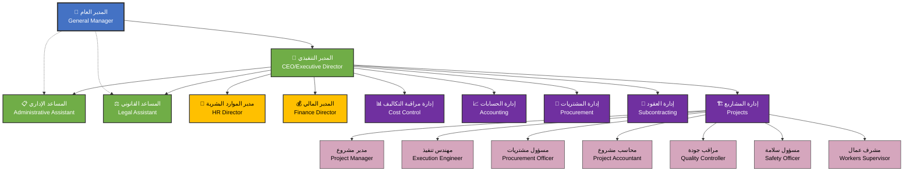

# الهيكل التنظيمي المطوّر لشركة أوتاد الفهد للمقاولات

## 1. البيانات التعريفية للوثيقة
- **رمز الوثيقة:** EXE-ORG-002
- **تاريخ الإصدار:** 15/02/2025
- **تاريخ آخر تحديث:** 15/12/2025
- **الإدارة المسؤولة:** الإدارة العليا
- **المسؤول عن التطبيق:** المدير العام
- **تاريخ المراجعة القادمة:** 15/02/2026

## 2. الغرض من الوثيقة
تهدف هذه الوثيقة إلى توضيح الهيكل التنظيمي المطوّر لشركة أوتاد الفهد للمقاولات، وتحديد خطوط الإبلاغ والمسؤوليات والعلاقات التنظيمية بين مختلف الإدارات والأقسام. وتشمل أهداف الوثيقة ما يلي:

- **توضيح التسلسل الإداري وخطوط الإبلاغ:** إبراز هيكلية السلطة من الأعلى إلى الأسفل
- **تحديد المسؤوليات والصلاحيات لكل منصب:** وصف مهام وصلاحيات كل دور وظيفي بوضوح
- **تسهيل التواصل والتنسيق بين الإدارات:** دعم قنوات الاتصال الفعّالة بين مختلف الأقسام
- **ضمان الوضوح في توزيع المهام:** توزيع واضح للمهام والمسؤوليات لتجنب التداخل أو الازدواجية
- **دعم عمليات اتخاذ القرار والحوكمة:** تعزيز الشفافية والمساءلة في عملية اتخاذ القرارات الإدارية

## 3. نطاق التطبيق
يُطبق هذا الهيكل التنظيمي على جميع الموظفين وفي كافة المستويات في شركة أوتاد الفهد للمقاولات.

## 4. المخطط التنظيمي المطوّر (Organogram)

### 🔵 المستوى 0: القيادة العليا

#### المدير العام (General Manager)
- المرجعية النهائية والقرارات السيادية للشركة
- يشرف على المدير التنفيذي مباشرة
- يعتمد السياسات العامة والخطط الاستراتيجية

🟨 **ملاحظة مهمة:** لا يجب أن يتدخل المدير العام في تفاصيل التنفيذ، بل يعتمد ما يرفعه المدير التنفيذي، مع الاحتفاظ بحق التدخل في القرارات السيادية فقط.

### 🔵 المستوى 1: الإدارة التنفيذية

#### المدير التنفيذي (CEO / Executive Director)
- المسؤول الأول عن إدارة جميع عمليات الشركة اليومية
- يتمتع بصلاحية تنفيذية كاملة على الإدارات التنفيذية والدوائر المساندة
- يُرفع إليه جميع التقارير الإدارية والفنية والمالية

#### المساعد الإداري
- يقدم الدعم التنفيذي لكل من المدير العام والمدير التنفيذي
- مسؤول عن التنسيق، الأجندات، إعداد الاجتماعات، متابعة القرارات العليا

#### المساعد القانوني
- مسؤول عن مراجعة العقود، تقديم الاستشارات القانونية، دعم القرارات الاستراتيجية

✅ **توصية تنظيمية مهمة:**
ضع حدودًا واضحة لتدخل المدير العام في العمليات التنفيذية، بحيث يتعامل مع المدير التنفيذي فقط، ويُمنع التواصل المباشر مع مديري الإدارات إلا عبر المدير التنفيذي، لتفادي التداخل والصلاحيات المزدوجة.

### 🔵 المستوى 1.5: المستشارين التنفيذيين

#### مدير الموارد البشرية (HR Director)
- يعتبر جهة استشارية وتنفيذية
- يدير التوظيف، الرواتب، الهيكل الوظيفي، الأداء، التدريب

#### المدير المالي (Finance Director)
- يشرف على جميع العمليات المالية والمحاسبية
- يقدم تقاريره مباشرة للمدير التنفيذي، مع حق الوصول المباشر للمدير العام في التقارير المالية الرسمية

🔄 **علاقة متوازنة:**
توثيق العلاقة بين المدير التنفيذي ومديري الموارد البشرية والمالية عبر اجتماعات أسبوعية رسمية ومهام محددة مسبقًا. صلاحياتهم يجب أن تُنظم بوضوح لتفادي تضارب أو ازدواج مسؤوليات.

### 🔵 المستوى 2: الإدارات التنفيذية الرئيسية
(تحت إشراف المدير التنفيذي)

1. **إدارة مراقبة التكاليف (Cost Control)**
   - مسؤولة عن متابعة تكاليف المشاريع، تحليل الانحرافات، اعتماد أوامر الشراء

2. **إدارة الحسابات (Accounting)**
   - تنفيذ العمليات المحاسبية، إعداد التقارير المالية، مراجعة الذمم المدينة والدائنة

3. **إدارة المشتريات (Procurement)**
   - طلبات الشراء، أوامر الشراء، العلاقات مع الموردين، المقارنات والعقود

4. **إدارة العقود (Subcontracting)**
   - التعاقد مع المقاولين من الباطن، صياغة العقود، متابعة التنفيذ والتقارير القانونية

5. **إدارة المشاريع (Projects)**
   - يدير جميع مشاريع الشركة الميدانية
   - كل مشروع يحتوي على هيكل فرعي:
     - مدير مشروع
     - مهندس تنفيذ
     - مسؤول مشتريات
     - محاسب مشروع
     - مراقب جودة
     - مسؤول سلامة
     - مشرف عمال

## 5. مخطط Mermaid للهيكل التنظيمي

## 6. كيفية قراءة المخطط التنظيمي

لفهم المخطط التنظيمي بشكل صحيح، يُرجى مراعاة دليل القراءة التالي:

- **المستوى 0 (باللون الأزرق):** يمثل المدير العام ويعتبر أعلى سلطة في الشركة
- **المستوى 1 (باللون الأخضر):** يمثل المدير التنفيذي والمساعدين المباشرين
- **المستوى 1.5 (باللون الأصفر):** يمثل المستشارين التنفيذيين (الموارد البشرية والمالية)
- **المستوى 2 (باللون البنفسجي):** يمثل مديري الإدارات التنفيذية الرئيسية
- **المستوى الفرعي (باللون الوردي):** يمثل الهيكل الفرعي للمشاريع

## 7. المسؤوليات الرئيسية لكل مستوى إداري

### المدير العام
- وضع الرؤية الاستراتيجية العامة للشركة
- اتخاذ القرارات السيادية والاستراتيجية المصيرية
- الإشراف على المدير التنفيذي وتقييم أدائه
- تمثيل الشركة أمام الجهات الخارجية الرئيسية

### المدير التنفيذي
- إدارة العمليات اليومية للشركة
- تنفيذ الاستراتيجيات المعتمدة من المدير العام
- الإشراف على جميع الإدارات التنفيذية
- رفع التقارير الدورية للمدير العام

### المستشارين التنفيذيين
- تقديم الاستشارة المتخصصة في مجالاتهم
- دعم اتخاذ القرارات الاستراتيجية
- ضمان الامتثال للمعايير والقوانين

### مديري الإدارات
- إدارة العمليات التخصصية في إداراتهم
- تحقيق الأهداف المحددة لكل إدارة
- التنسيق مع الإدارات الأخرى
- رفع التقارير للمدير التنفيذي

## 8. آليات التحديث والمراجعة

لضمان أن الهيكل التنظيمي يبقى محدّثًا وملائمًا للتطورات:

- **المراجعة السنوية:** مراجعة شاملة للهيكل التنظيمي سنوياً
- **التحديثات الطارئة:** إمكانية التحديث عند الحاجة الماسة
- **الاعتماد والموافقة:** جميع التحديثات تحتاج موافقة المدير العام
- **التوزيع والإبلاغ:** إبلاغ جميع الموظفين بالتغييرات خلال 48 ساعة
- **التوثيق والأرشفة:** الاحتفاظ بنسخ من جميع الإصدارات السابقة

## 9. خطوط الإبلاغ والتواصل

### مبادئ التواصل:
- **التواصل الرسمي:** وفق التسلسل الهرمي المحدد
- **الحالات الطارئة:** إمكانية التواصل المباشر مع إخطار المسؤول المباشر
- **التنسيق الأفقي:** مشجّع بين الإدارات في نفس المستوى
- **التقارير الدورية:** وفق خطوط الإبلاغ المحددة
- **الاجتماعات:** منتظمة حسب المستويات التنظيمية

## 10. الإحالات والمراجع

يُرجى الرجوع إلى هذه الوثيقة عند مراجعة أو تحديث:
- سياسات الموارد البشرية
- سياسات الشؤون المالية والمحاسبة
- سياسات إدارة المشاريع والعمليات
- سياسات المشتريات والعقود
- سياسات تقنية المعلومات
- جميع السياسات الإدارية والتشغيلية الأخرى

## 11. تاريخ الاعتماد والتحديث

- **تاريخ الاعتماد الأولي:** 15/02/2025
- **آخر تحديث:** 15/12/2025 (الإصدار 2.0)
- **موعد المراجعة القادمة:** 15/02/2026

يتم مراجعة هذا الهيكل التنظيمي سنويًا أو عند الحاجة، وذلك لضمان مواكبته للمتغيرات والتطورات الجديدة ومتطلبات العمل.